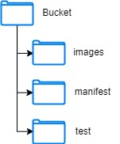

# Rekognition-demo

AWS Rekognition demo, using some images of the DeepFashion2 dataset.

This demo focus on using the DeepFashion2 dataset, that is a complex clothing classification dataset to train a AWS Rekognition model into identify clothing pieces on images. It uses two python scripts, one to translate the Deepfashion annotations on COCO (Common Objects in Context) notations and another that transform this file into a manifest file, that is used by AWS Rekognition to label imagel images. It's the user work to create the S3 bucket to store the images and manifest file created by the scripts, and create the model on AWS Rekognition using the manifest file created by the scripts.

# How to use

  To use the model we need a s3 bucket setup with all the images, then follow the building order using the python scripts, after that, upload the manifest file in the s3, then use it to create the AWS Rekognition Custom Label dataset, then start the model training using it.

  To use the model, the images used should be in a s3 bucket.


## `S3`

  - Create a S3 bucket
  - Upload all images in the S3 using the path "images/"

  for convenience we used this schema for the bucket :

  

## `Build`

 - Change the s3_bucket_name in coco_to_manifest.py.

 - Run to create the coco file:
  ```
    python coco_to_manifest.py
  ```

 - Run to create the manifest file and upload the S3:
  ```
    python coco_to_manifest.py
  ```

## `Train`

  - Create a AWS Rekognition Custom Label Model using the .manifest.
  - Start model training.
